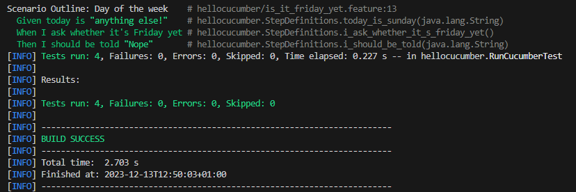
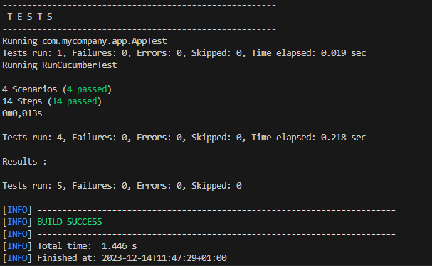
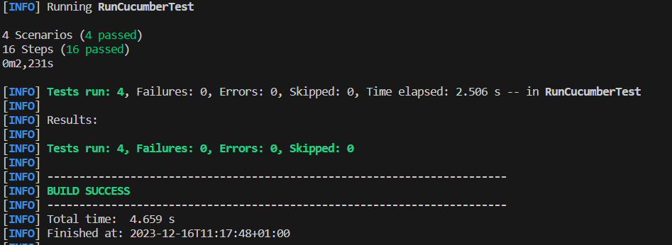

= R5.A.08 -- Dépôt pour les TPs
:icons: font
:MoSCoW: https://fr.wikipedia.org/wiki/M%C3%A9thode_MoSCoW[MoSCoW]

Ce dépôt concerne les rendus de mailto:romain.massip@etu.univ-tlse2.fr[Romain Massip].

== TP1

.Exemple de code
[source,java]
---
Feature: Is it Friday yet?
  Everybody wants to know when it's Friday
    Scenario Outline: Day of the week
    Given today is "<day>"
    When I ask whether it's Friday yet
    Then I should be told "<answer>"
    Examples:
    | day            | answer |
    | Friday         | TGIF   |
    | Sunday         | Nope   |
    | anything else! | Nope   |
---

.Exemple d'image insérée en asciidoc

== TP2

[source,java]
---
  class Order{

    private String owner;
    private String target;
    private String message;
    private List<String> cocktails = new ArrayList<String>();

    public void declareOwner(String string) {
        this.owner = string;
    }

    public void setMessage(String string) {
        this.message = string;
    }

    public Object getMessage() {
        return("From "+this.owner+" to "+this.target+": "+this.message);
    }

    public List<String> getCocktails() {
        return cocktails;
    }

    public void declareTarget(String string) {
        this.target = string;

    }

    public void nbrCocktail(Integer nbr) {
        for(int i =0;i< nbr;i++){
            this.cocktails.add("Cocktail");
        }
    }
---

== TP3

=== Feature:

Feature: Test Pixel

    Scenario Outline: Test du Pixel avec couleur
        Given J'ai une image "<Etoile>"
        When je fais le changement en "<couleur1>" est blanc
        And que je recupère la couleur du pixel au coordonnée 1 1
        Then la couleur doit être blanc

    Examples:
        | couleur1 | Etoile                |
        | Noir     | resources\Etoile2.jpg |
        | Bleu     | resources\Etoile2.jpg |
        | Vert     | resources\Etoile2.jpg |
        | Rouge    | resources\Etoile2.jpg |

